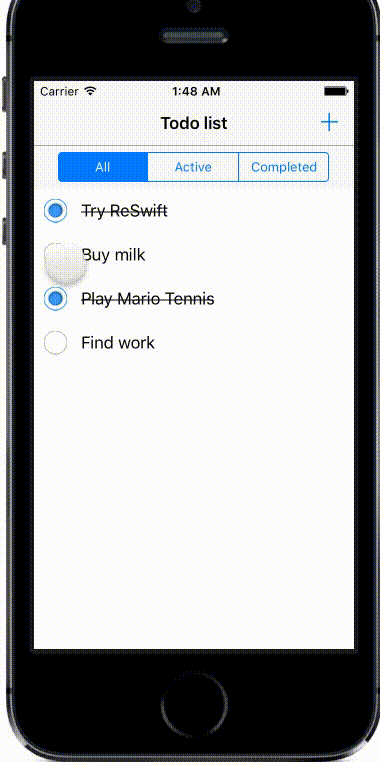

# ReSwift-Todo

ReSwift-Todo is a simple todo list.

It is a [ReSwift](https://github.com/ReSwift/ReSwift) version of [Redux's todomvc](https://github.com/rackt/redux/tree/master/examples/todomvc).

## Implementation details

State updates trigger a diff of the filtered todos using [Dwifft](https://github.com/jflinter/Dwifft). This enables us to make use of UITableView's built-in animations when inserting and deleting rows (see gif below)

## Gif demo

## What's next ?

Here are a few things ReSwift-Todo could have fun with :

* [ReSwift-Recorder](https://github.com/ReSwift/ReSwift-Recorder) enables hot-reloading and time-travel for ReSwift apps !
* [ReSwift-Router](https://github.com/ReSwift/ReSwift-Router) is a declarative router for ReSwift. We could implement this into ReSwift-Todo to move avay from the storyboard segues and keep the navigation state inside the AppState !
